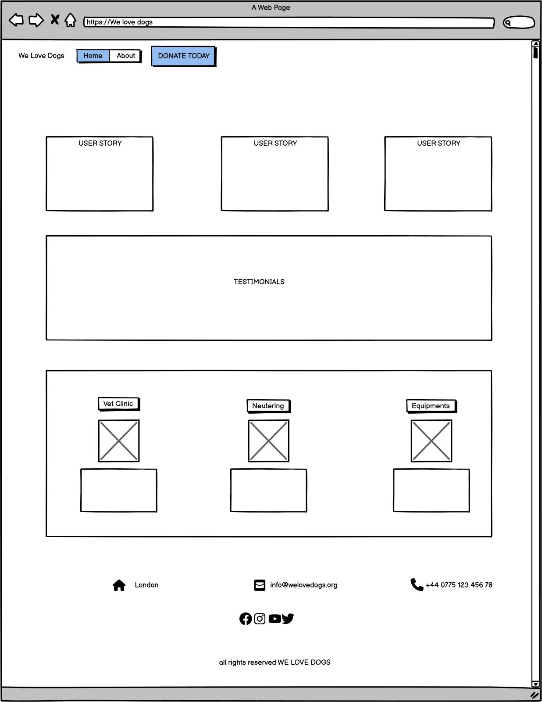
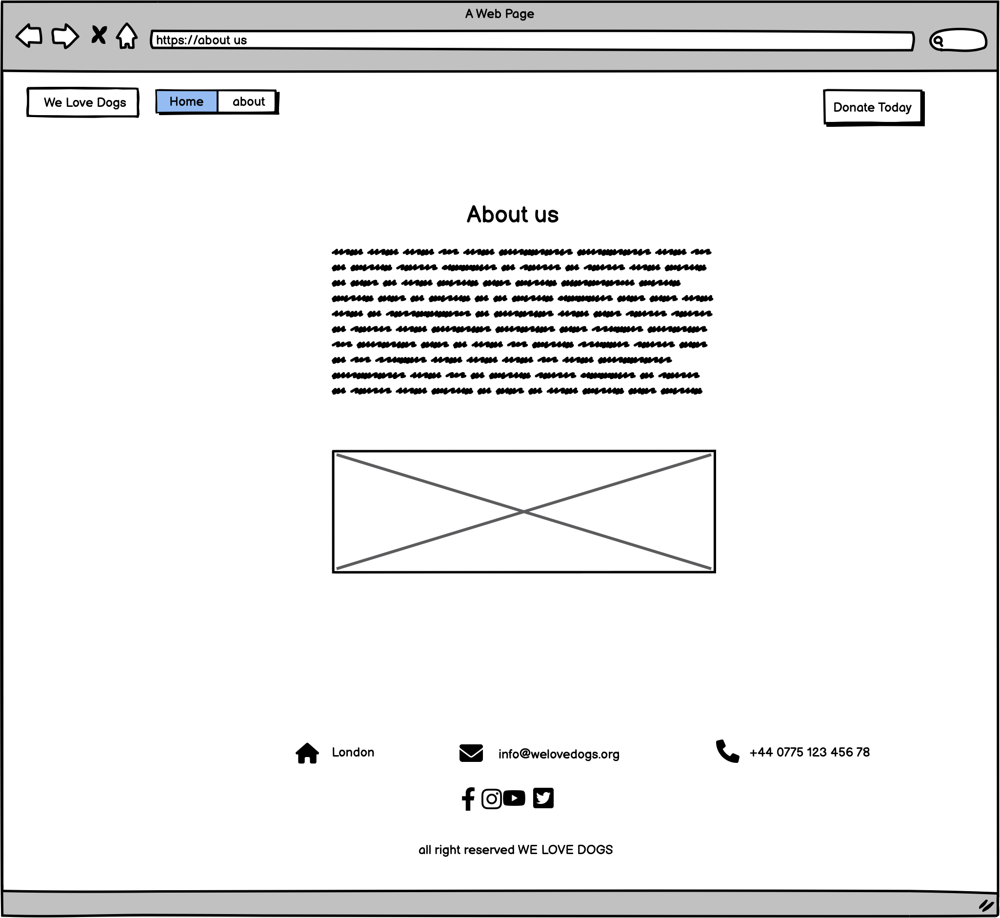
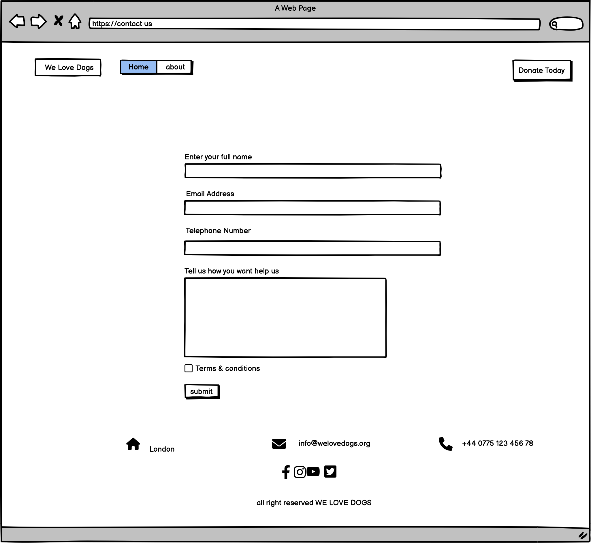

**We Love Dogs**

# Project Overview
This is a Website where the community can interact with others in one single site about how to find all kind of help a dog shelter. We help the abandoned dogs!

This project was built using html, Bootstrap 4, and css. The site was deployed on Github.

**We Love Dogs** is a Milestone Project 1 submission on June 2023.

### **Project Goals**
This section aims to make the org webpage for abandoned dogs and in the future be able to provide a shelter to cats

## **Skeleton Plane**
* ### Wireframes
 It's been made sure they met the user and owner group criteria. As a result were used as a design for the project.

 

### **Features**

     * Responsive on all device sizes

* **Donate today button**
    * Responsive on all device sizes
    * A button on green color to catches attention of the visitors.

* **Hero Image**
    * A image related to dogs that normally are abandoned some others die in the street that's why it feels related to the topic of the webpage.

* **Navbar**

* 
    * Home: Brings the user to the home page

    * About Us: Opens the page where a briefly tells the history of the origen of the refugee.

    * contact us: Opens the form for donors to leave their details to get in contact.

* **User Histories**
    * User stories in the landscape help the user to understand the average of the reasons that causes the abandonment of pets.

    *
* **Histories & Testimonials**
    * Add testimonials for donors that became sponsors to share their histories.

*  **Footer**
    

   * Email link: It takes the user to the contact us page.

    * Telephone : It takes the user to the contact us page.

   * facebook link: It takes the user to the facebook home page.

   * instagram link: It takes the useer to the Instagram home page.

   * Youtube: It takes the useer to the youtube channel of the shelter.

   * twitter It takes the useer to the Twitter home page.

## **Languages Used**

*   ### [HTML5](https://en.wikipedia.org/wiki/HTML5)
*   ### [CSS3](https://en.wikipedia.org/wiki/Cascading_Style_Sheets)

## **Frameworks, Libraries & Programs Used**

*   ### 1. [Bootstrap 4.4.1:](https://getbootstrap.com/docs/4.4/getting-started/introduction/)
    - Bootstrap was used to assist with the responsiveness and styling of the website.
*   ### 2. [jQuery:](https://jquery.com/)
    - jQuery came with Bootstrap to make the navbar responsive but was also used for the smooth scroll function in JavaScript.
*   ### 3. [Git](https://git-scm.com/)
    - Git was used for version control by utilizing the Gitpod terminal to commit to Git and Push to GitHub.
*   ### 4. [GitHub:](https://github.com/)
    - GitHub is used to store the projects code after being pushed from Git.

*   ### 5. [Balsamiq:](https://balsamiq.com/)
    - Balsamiq was used to create the [wireframes](https://github.com/) during the design process.

##   **Acknowledgements**
*   ###    **To Code Institute for their support.**
